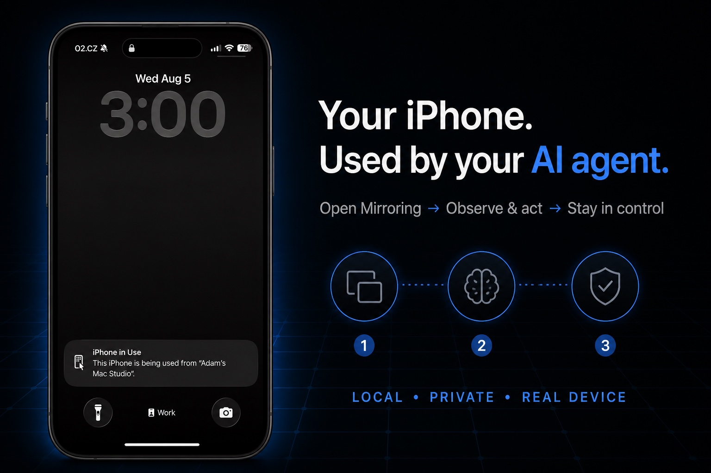

# Phone Use

Use a real iPhone from an AI agent running on your Mac.

<p align="center">
  
</p>

Phone Use gives local agents a simple way to see the current iPhone screen,
and a guarded CLI for tap, swipe, typing, and system controls through Apple’s
iPhone Mirroring.
The phone stays paired through Apple’s normal Continuity flow; Phone Use does
not jailbreak the device, bypass its passcode, or send the screen to a cloud
service.

Phone Use is useful for:

- checking Messages, Mail, calendars, notifications, or another mobile-only
  app without taking your hands away from the Mac;
- letting an agent observe a mobile-only flow without changing the foreground
  Mac application;
- testing a website or app on a physical iPhone rather than a simulator;
- navigating an app and stopping before a sensitive action such as sending,
  deleting, purchasing, or publishing;
- giving an agent visual, pixel-based access to an app that has no API.

## Requirements

- an Apple silicon Mac running macOS 15 or newer;
- an iPhone that already works with Apple’s **iPhone Mirroring** app;
- both devices signed in and configured for Apple’s normal Mirroring flow;
- the iPhone powered on, nearby, and locked while the agent uses it;
- Wi-Fi and Bluetooth enabled.

Phone Use cannot operate a powered-off or distant phone. It cannot bypass an
Apple Account, passcode, regional restriction, or the normal iPhone Mirroring
requirements.

## Install

### Current private preview: build from source

Source builds require Xcode command-line tools and Node.js 20 or newer:

```sh
npm install
npm run signing:doctor
npm run package:dev
open dist
```

Drag `Phone Use.app` from `dist` into **Applications**, then open it.

`package:dev` requires a stable Apple Development or local code-signing
identity so macOS permission grants survive rebuilds. See
[PACKAGING.md](PACKAGING.md) for developer signing setup.

### Homebrew — recommended release channel after launch

The signed Homebrew channel is prepared but not published yet. Once the first
release is available, install it with:

```sh
brew tap zvadaadam/tap
brew install --cask phone-use
open -a "Phone Use"
```

The Cask installs both `Phone Use.app` and the `phone-use` command.

### Signed disk image — after launch

Once published, download `Phone-Use-<version>.dmg` from the
[latest release](https://github.com/zvadaadam/homebrew-tap/releases/latest),
open it, and drag **Phone Use** to **Applications**. The release DMG, app, and
embedded CLI are Developer ID-signed and notarized.

Commands below use `phone-use`, which Homebrew adds to your `PATH`. With a DMG
install, use `/Applications/Phone Use.app/Contents/Helpers/phone-use`. From a
source checkout, use `./scripts/phone-use`.

## One-time setup

1. Open Apple’s **iPhone Mirroring** app and confirm it can connect to your
   iPhone normally.
2. Quit iPhone Mirroring, lock the iPhone, and keep it nearby.
3. Open **Phone Use**. It appears in the Mac menu bar.
4. In **System Settings → Privacy & Security**, grant **Phone Use**:
   - **Screen & System Audio Recording**;
   - **Accessibility**.
5. Quit and reopen Phone Use after changing either permission.
6. Check the setup:

```sh
phone-use doctor
```

Both permission fields should be `true`. These grants normally happen once for
the signed app; upgrading the same release should not ask again.

## Start using it

Open the local dashboard:

```sh
phone-use dashboard
```

The dashboard shows the live phone surface without changing Mac focus. Its
controls are disabled in the current preview: Apple iPhone Mirroring ignores
the proven public synthetic-input route unless it is frontmost, and Phone Use
never activates, raises, or focuses it.

For agents and scripts, the CLI exposes the same flow:

```sh
phone-use open
phone-use status
phone-use observe /tmp/iphone.jpg
phone-use tap 0.50 0.72
phone-use swipe 0.50 0.80 0.50 0.25 350
phone-use type "hello from my Mac"
phone-use home
phone-use apps
phone-use spotlight
phone-use close
```

Tap and swipe coordinates are normalized from `0` to `1`, starting at the
top-left of the visible iPhone screen. Agents should take a fresh screenshot,
decide on one action, perform it, and observe again. `observe` also prints a
64-character visual frame token. Pass it back with `--frame-token <token>` to
reject an action if the phone has meaningfully changed in the meantime. The
token tolerates harmless JPEG noise, a caret blink, and small thumbnail fades.

Control commands succeed only when iPhone Mirroring is already frontmost. They
fail closed in the normal background-agent case. This is intentional: global
HID delivery is the only public route proven to control the physical phone,
while per-process events do not register. Phone Use does not hide that platform
limit behind a temporary focus switch.

## Example prompts for an agent

The best prompts state the task, the allowed actions, and where the agent must
stop.

### Check unread messages without sending anything

> Use Phone Use to open my iPhone and inspect Messages. Tell me which
> conversations appear unread and summarize only what is visible. Do not type,
> send, delete, or mark anything as read if that can be avoided. Close the
> Phone Use session when finished.

### Check the latest email

> Use Phone Use to open Mail on my iPhone. Find the newest inbox message and
> report the sender, subject, time, and a short summary. Treat this as read-only:
> do not reply, archive, delete, follow links, or download attachments.

### Draft a response but stop before sending

> Use Phone Use to open my most recent conversation with Alex. Draft this
> reply: “I can join at 3 PM.” Stop before tapping Send and show me the final
> composed message for approval.

### Navigate to a setting

> Use Phone Use to find the notification settings for Slack on my iPhone.
> Explain the current settings and stop before changing any toggle.

### Test a mobile flow on the physical phone

> Use Phone Use to open our staging app and test sign-in with the provided test
> account. Capture a fresh screenshot after every step, report any visual or
> interaction failure, and sign out when finished. Do not change device-wide
> settings or use a production account.

### Open an app and complete a bounded task

> Use Phone Use to open Spotify, search for “Discovery Weekly,” and open the
> playlist. Do not start playback, follow an artist, or modify my library.

For consequential tasks, explicitly require the agent to stop before the final
send, purchase, delete, publish, account, permission, or security action.

## CLI reference

| Command | Result |
| --- | --- |
| `phone-use dashboard` | Open the authenticated local dashboard |
| `phone-use doctor` | Check installation, permissions, and Mirroring |
| `phone-use status` | Return the current session and frame status |
| `phone-use open` | Start iPhone Mirroring without activating it, then wait for a live session |
| `phone-use observe <file.jpg>` | Save one fresh phone screenshot |
| `phone-use tap [flags] <x> <y>` | Tap a normalized screen coordinate |
| `phone-use swipe [flags] <x> <y> <x2> <y2> [ms]` | Perform one swipe |
| `phone-use type [flags] <text>` | Type supported physical-key text into the focused phone field |
| `phone-use home [flags]` | Go to the iPhone Home Screen |
| `phone-use apps [flags]` | Open the iPhone App Switcher |
| `phone-use spotlight [flags]` | Open iPhone Search |
| `phone-use close` | Close Mirroring and clear the current frame |
| `phone-use version` | Print the installed version |

The packaged helper is also available at:

```text
/Applications/Phone Use.app/Contents/Helpers/phone-use
```

Agents should use the CLI or dashboard instead of reading the local bearer
token directly.

Control flags:

- `--frame-token <token>` binds the action to the most recently observed visual
  state and fails closed after a meaningful layout change.

## What to expect

- Phone Use is visual and pixel-based. It does not expose a semantic iOS
  accessibility tree, so agents must observe again after acting.
- Capture is background-safe. Reliable public control is foreground-only;
  Phone Use never brings Apple Mirroring forward and rejects the command when
  it is not already frontmost.
- The action response distinguishes event posting, complete delivery, visible
  phone change, and whether Mac focus stayed unchanged. A failed result must
  be observed before retrying because a partial gesture cannot be rolled back.
- The physical iPhone cannot be used directly while an active Mirroring
  session controls it. Unlocking or using the phone may pause the session.
- The first Apple connection or a recovery flow can require you to unlock the
  phone manually once.
- Some protected, video, banking, authentication, or DRM surfaces may hide
  content or prevent interaction.
- Apple does not publish an iPhone Mirroring automation SDK, so a future macOS
  update may require a Phone Use update.
- Phone Use is not a remote-device farm, simulator service, or general iPhone
  management API.

## Privacy and safety

Phone Use runs locally on the Mac and listens only on `127.0.0.1:8747`. The
dashboard and every API route require local authentication. Screenshots are
processed in memory and are not kept as a recording; `phone-use observe` writes
only the image path you explicitly request.

Anyone who can control your logged-in macOS account and invoke `phone-use` can
operate the paired phone. Do not expose, proxy, or tunnel port `8747`, and do
not give an agent broader phone authority than the task requires.

Read [SECURITY.md](SECURITY.md) and [PRIVACY.md](PRIVACY.md) for the complete
security and data-handling model.

## Troubleshooting

### `Waiting for iPhone Mirroring`

- Confirm Apple’s iPhone Mirroring app works by itself.
- Keep the iPhone powered on, nearby, and locked.
- Enable Wi-Fi and Bluetooth on both devices.
- If you recently used or restarted the iPhone, unlock it manually once, then
  lock it again.
- Run `phone-use close`, then `phone-use open`.

### Permission check is false

Open **System Settings → Privacy & Security**, enable Phone Use under both
**Screen & System Audio Recording** and **Accessibility**, then quit and reopen
Phone Use. Grant permissions to the installed `/Applications/Phone Use.app`,
not a temporary or ad-hoc development build.

### The screen is visible but control fails

- Lock the physical iPhone and wait for Mirroring to reconnect.
- Run `phone-use doctor` and `phone-use status`.
- If iPhone Mirroring is not already frontmost, the current control backend is
  deliberately unavailable. Phone Use will not change Mac focus to make it work.
- Make sure another copy of Phone Use is not running from `dist` or Downloads.
- Close and reopen the session before retrying the action.

## For contributors

```sh
npm test
npm run check
npm run test:smoke
npm run test:device
npm run test:focus
```

Implementation and release details live outside the user guide:

- [PACKAGING.md](PACKAGING.md) — signing, notarization, DMG, and Homebrew;
- [SECURITY.md](SECURITY.md) — authentication and control boundaries;
- [PRIVACY.md](PRIVACY.md) — frame, text, and local-data handling;
- [FEASIBILITY.md](FEASIBILITY.md) — Apple platform constraints;
- [RESEARCH.md](RESEARCH.md) — prior-art and transport research;
- [CHANGELOG.md](CHANGELOG.md) — release history.
